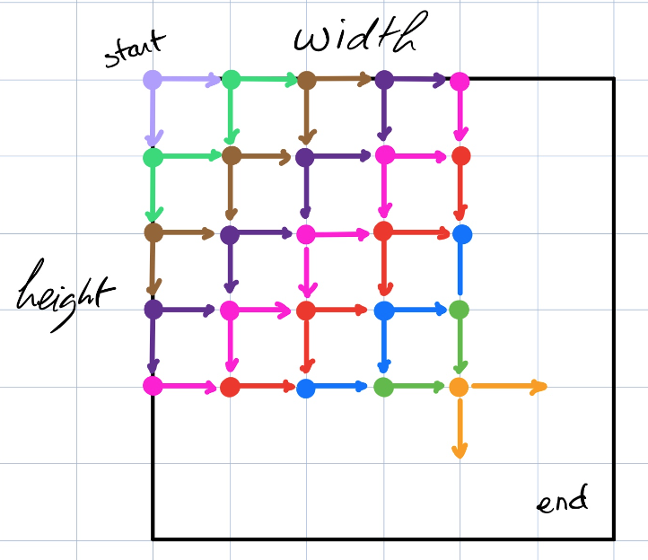
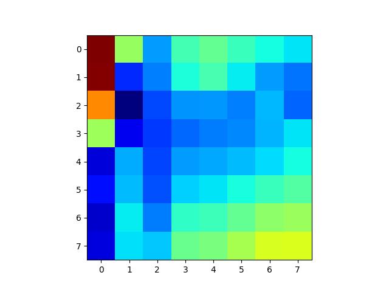
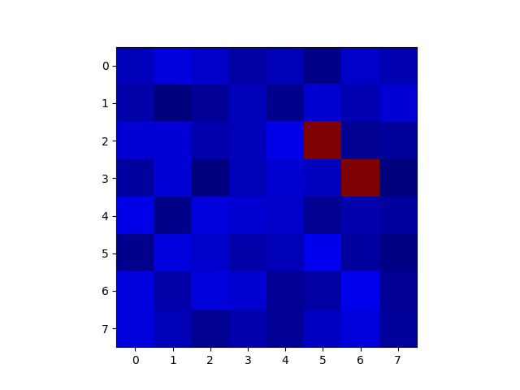
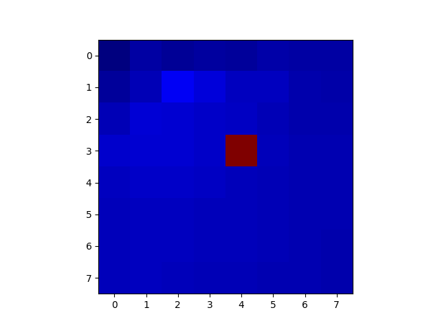
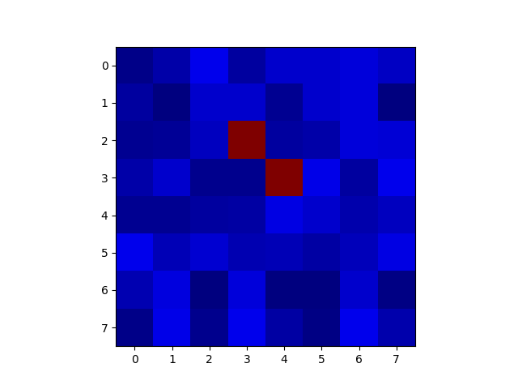
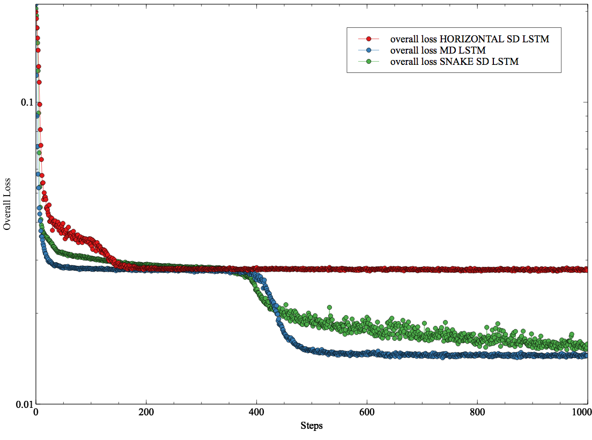
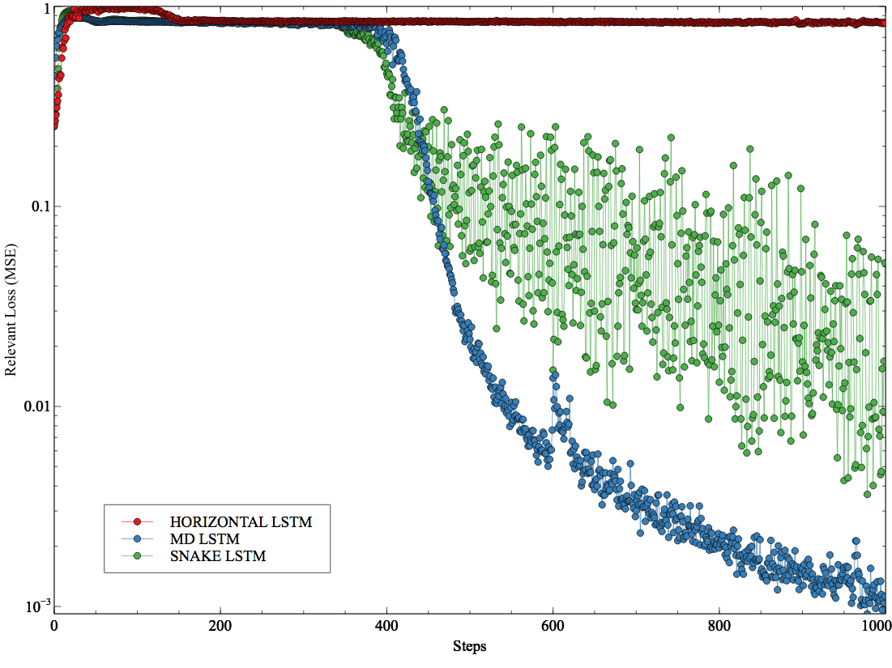

# Multi Dimensional Recurrent Networks
Tensorflow Implementation of the model described in Alex Graves' paper https://arxiv.org/pdf/0705.2011.pdf

- [x] **Fully compatible with Tensorflow 1.x support.**
- [x] **True multi dimensional ability (not LSTM on *M* time series, but more on a grid of dimension *M*).**
- [x] **Only 2D is supported now.**

<p align="center">
  
  <br><i>Example: 2D LSTM Architecture</i>
</p>

## What is MD LSTM?

> Recurrent neural networks (RNNs) have proved effective at one dimensional sequence learning tasks, such as speech and online handwriting recognition. Some of the properties that make RNNs suitable for such tasks, for example robustness
to input warping, and the ability to access contextual information, are also desirable in multidimensional domains. However, there has so far been no direct way of applying RNNs to data with more than one spatio-temporal dimension. This paper introduces multi-dimensional recurrent neural networks (MDRNNs), thereby extending the potential applicability of RNNs to vision, video processing, medical imaging and many other areas, while avoiding the scaling problems that have plagued other multi-dimensional models. Experimental results are provided for two image segmentation tasks.


> -- Alex Graves, Santiago Fernandez, Jurgen Schmidhuber

<p align="center">
  
  <br><i>Example: 2D LSTM Architecture</i>
</p>

## How to get started?
```
git clone git@github.com:philipperemy/tensorflow-multi-dimensional-lstm.git
cd tensorflow-multi-dimensional-lstm

# create a new virtual python environment
virtualenv -p python3 venv
source venv/bin/activate
pip install -r requirements.txt

# usage: trainer.py [-h] --model_type {MD_LSTM,HORIZONTAL_SD_LSTM,SNAKE_SD_LSTM}
python trainer.py --model_type MD_LSTM
python trainer.py --model_type HORIZONTAL_SD_LSTM
python trainer.py --model_type SNAKE_SD_LSTM
```

## Random diagonal Task

The random diagonal task consists in initializing a matrix with values very close to 0 except two which are set to 1. Those two values are on a straight line parallel to the diagonal of the matrix. The idea is to predict where those two values are. Here are some examples:

```
____________
|          |
|x         |
| x        |
|          |
|__________|


____________
|          |
|          |
|     x    |
|      x   |
|__________|

____________
|          |
| x        |
|  x       |
|          |
|__________|

```

- A simple recurrent model going vertical or horizontal cannot predict any locations of x. This model is called `HORIZONTAL_SD_LSTM`. It should perform the worst.
- If the matrix is flattened as one single vector, then the first location of x still cannot be predicted. However, a recurrent model should understand that the second x always comes after the first x (width+1 steps). (Model is `SNAKE_SD_LSTM`).
- When predicting the second location of x, a MD recurrent model has a full view of the TOP LEFT corner. In that case, it should understand that when the first x is in the bottom right of its window, the second x will be next on the diagonal axis. Of course the first location x still cannot be predicted at all with this MD model.


<p float="left">
  
   
  <br><i>MD LSTM predictions (left) and ground truth (right) before training.</i>
</p>

<p float="left">
  
   
  <br><i>MD LSTM predictions (left) and ground truth (right) after training.</i>
</p>

<p align="center">
  <b>Overall loss of the random diagonal task (loss applied on all the elements of the inputs)</b><br><br>
  
</p>


<p align="center">
  <b>Overall loss of the random diagonal task (loss applied only on the location of the second x)</b><br><br>
   
</p>


## Special Thanks
- A big *thank you* to [Mosnoi Ion](https://stackoverflow.com/questions/42071074/multidimentional-lstm-tensorflow) who provided the first skeleton of this MD LSTM.
